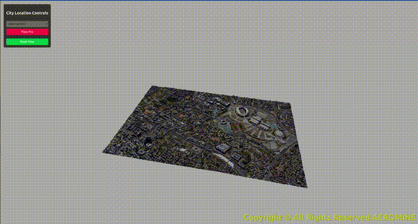

# 3D-Evacuation-Plan — Aeromine Project

This project is a **3D evacuation plan application** developed for Aeromine as part of one of their patents. **All copyrights are owned by Aeromine.**

It visualizes 3D models of buildings and overlays directional arrows for evacuation purposes.

---

## Features

* Display `.gltf` 3D models of buildings
* Overlay directional arrows for evacuation paths
* Future plans: make the system **dynamic** and apply it to **governmental buildings, malls, airports, workplaces**, etc. (pending patent approval)

---

## Installation

1. Clone the repository:

```bash
git clone https://github.com/<your-org>/3D-Evacuation-Plan-Aeromine.git
cd 3D-Evacuation-Plan-Aeromine
```

2. Install dependencies:

```bash
npm install
```

3. Start the development server:

```bash
npm run dev
```

4. Open in your browser:

```
http://localhost:5173
```

---

## Usage

* Replace the default `.gltf` model with your own.
* Adjust the **coordinates for arrows** in the scene to match your model’s layout.

---

## Technologies Used

* **React** — Frontend library
* **TypeScript** — Strongly typed JavaScript
* **Vite** — Fast build tool
* **Three.js** — 3D rendering engine
* **ESLint** — Code linting

---

## Development Setup

### ESLint Configuration (Optional)

For production or stricter linting:

```js
// eslint.config.js
import tseslint from '@ts-eslint/config'

export default tseslint.config({
  extends: [
    ...tseslint.configs.recommendedTypeChecked,
    ...tseslint.configs.strictTypeChecked,
    ...tseslint.configs.stylisticTypeChecked,
  ],
  languageOptions: {
    parserOptions: {
      project: ['./tsconfig.node.json', './tsconfig.app.json'],
      tsconfigRootDir: import.meta.dirname,
    },
  },
})
```

Optional React-specific linting:

```js
import reactX from 'eslint-plugin-react-x'
import reactDom from 'eslint-plugin-react-dom'

export default tseslint.config({
  plugins: { 'react-x': reactX, 'react-dom': reactDom },
  rules: {
    ...reactX.configs['recommended-typescript'].rules,
    ...reactDom.configs.recommended.rules,
  },
})
```

---

## Screenshots

Here are some screenshots of the 3D evacuation plan in action:


---

## 🎥 Demo Video

See the 3D viewer in action:




---


---

## Open Source

This project is **open source**, licensed under the [MIT License](LICENSE).

---

## Notes

* Currently, this is a **static prototype**.
* Future development aims to support **dynamic building layouts** and **interactive evacuation paths**.


