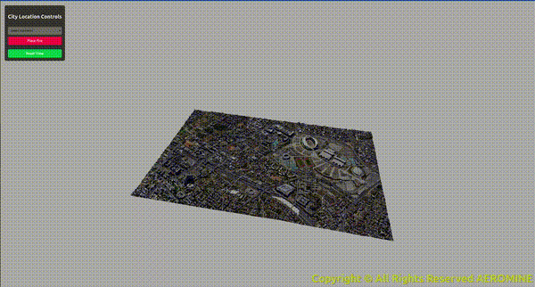

# 3D Evacuation Plan — Aeromine Project

This project is a **3D evacuation plan application** developed for **[Aeromine](https://www.aeromine.info/)** as part of one of their patents.  
**All copyrights are owned by [Aeromine](https://www.aeromine.info/).**

It visualizes **3D models of buildings** and overlays **directional arrows** for evacuation purposes.

---

## Features

- Interactive 3D environment rendered in the browser
- Display `.gltf` 3D models of buildings
- Overlay directional arrows for evacuation paths (with adjustable coordinates)
- Future plans: make the system **dynamic** and apply it to **governmental buildings, malls, airports, workplaces**, etc. (pending patent approval)

---

## Tech Stack

- **React 19** — Frontend library  
- **TypeScript** — Strongly typed JavaScript  
- **Vite** — Fast build tool  
- **Three.js** — 3D rendering engine  
- **React Three Fiber** — React renderer for Three.js  
- **@react-three/drei** — Useful helpers for R3F  
- **ESLint** — Code linting  

---

## Installation

1. **Clone the repository**
   ```bash
   git clone https://github.com/VasilisKokotakis/3D-Evacuation-Plan---Aeromine-Project.git
   cd 3D-Evacuation-Plan---Aeromine-Project

2. **Install dependencies**
   ```bash
   npm install

3. **Start the development server**
   ```bash
   npm run dev

4. **Build for production** 
   ```bash
   npm run build
   
5. **Preview production build**
   ```bash
   npm run preview

---

## Usage

* Replace the default `.glb` model with your own inside the `public/` folder.
* To add or edit locations and evacuation routes, update `src/data/evacuationRoutes.ts` — no other files need to be changed.
* Run the project (`npm run dev`) and view it locally in your browser.

---

## Screenshots

Here are some screenshots of the 3D evacuation plan in action:


---

## Demo Video

See the 3D viewer in action:



---

## License

The **source code** is licensed under the [MIT License](LICENSE).
The **concept, method, and patent rights** belong to [Aeromine](https://www.aeromine.info/).

---

## Notes

* Currently, this is a **static prototype**.
* Future development aims to support **dynamic building layouts** and **interactive evacuation paths**.

---

## Authors

Developed by **Vasileios Kokotakis** in collaboration with **[Aeromine](https://www.aeromine.info/)**.
